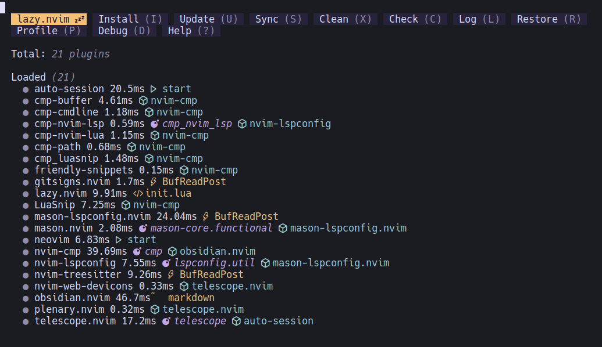
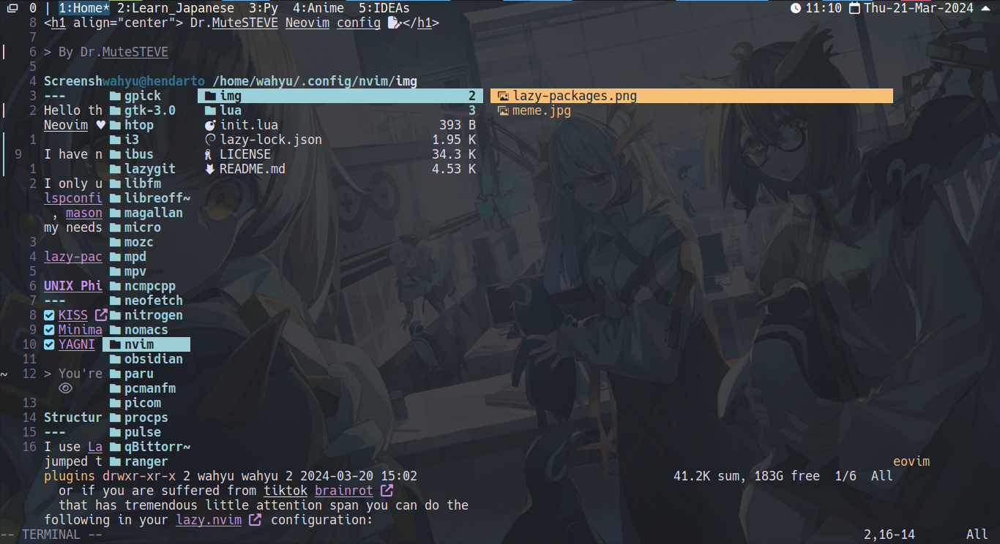
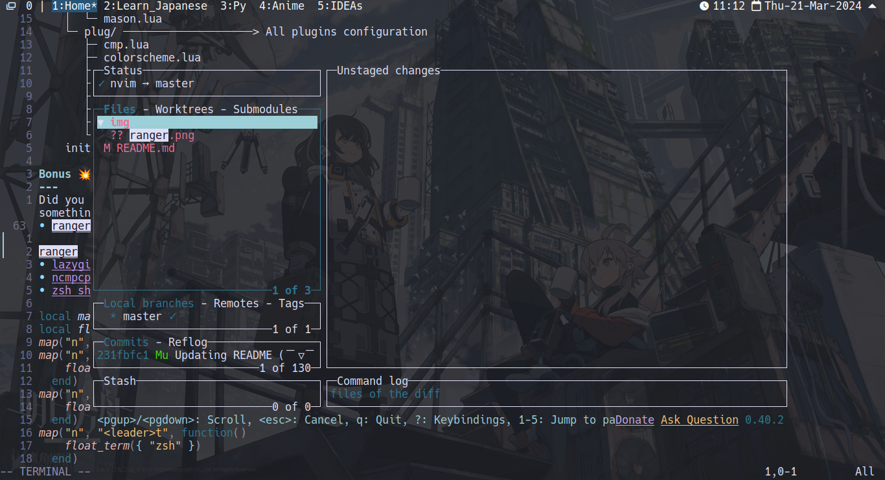
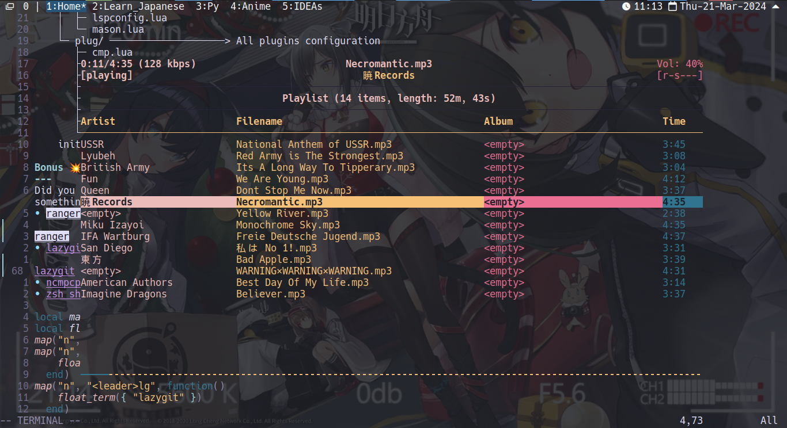
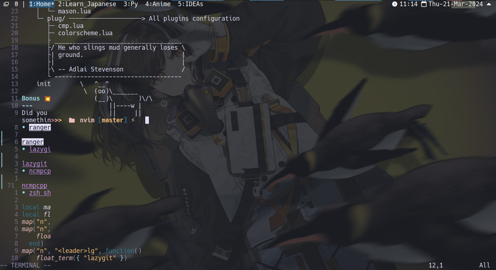

<h1 align="center"> Dr.MuteSTEVE Neovim config 📝</h1>

> By Dr.MuteSTEVE

<h3 align="center">Intro</h3>

Hello there 👋 I'm an 18 years old [digital minimalist](https://archive.org/details/digital-minimalism-by-cal-newport) and i love [Neovim](https://neovim.io/) , [GNU/Linux](https://www.gnu.org/gnu/linux-and-gnu.html) and [UNIX](https://id.wikipedia.org/wiki/Unix) in general ♥️\
I use Neovim for everything from learn to code, learn a project and taking daily notes 🗒️\
I have no intention to get into IT job 💼 i just love learning new things as hobby and life experience\
My configuration is original and not based on any neovim distro for the sake of minimalist

Screenshot 📸
---
<a href="https://www.youtube.com/watch?v=bYtdqwkZNPs">
    
</a>

[UNIX Philosophy](https://en.wikipedia.org/wiki/Unix_philosophy) based configuation🐧
---
- [x] [KISS](https://en.wikipedia.org/wiki/KISS_principle) (Less plugins = less breaking)
- [x] [Minimalism](https://en.wikipedia.org/wiki/Minimalism_(computing)) (Simply the nature of UNIX application)
- [x] [YAGNI](https://en.wikipedia.org/wiki/You_aren%27t_gonna_need_it) (Use full-blown IDE, **DON'T MAKE NEOVIM BLOATED**)
> You're probably soydev vscode spyware user called Microsoft windows 🪟 literally [Nineteen Eighty-Four](https://id.wikipedia.org/wiki/Nineteen_Eighty-Four) 👁️

Structure ⛓️
---
I use [Lazy loading 💤](https://en.wikipedia.org/wiki/Lazy_loading) technic to load all the plugins, so it won't feel heavy as i jumped through different file because of the pluins trigger activation. You can find it online on `how to lazy load neovim plugins` with [lazy.nvim](https://github.com/folke/lazy.nvim) or just read the docs of [lazy.nvim](https://github.com/folke/lazy.nvim) or if you are suffered from tiktok [brainrot](https://news.yahoo.com/what-is-brain-rot-tiktokers-are-using-the-term-to-describe-the-impact-of-being-chronically-online-211105483.html) that has tremendous little attention span you can do the following in your Lazy configuration:
```lua
-- lazy.lua ⚡
require("lazy").setup({
  spec = {
    -- It won't work if you have subdirectory, like lua/plug/something/
    -- Only works under one child directory of lua/
    { import = "lsp" }, 
    { import = "plug" },
  }
)
```
    lua/
    ├─ core/ ────────────────────> All the core components ──────────────────────────────────┐
    │  ├─ autocmd.lua ───────────> Handling action based on VIM trigger events               │
    │  ├─ icons.lua ─────────────> Returning plugins icons when needed                       │
    │  ├─ keymaps.lua ───────────> Custom keymaps                                            │
    │  ├─ lazy.lua ──────────────> Lazy.nvim package manager ──────────────┐                 │
    │  └─ options.lua ───────────> Neovim Options                          │                 │
    │                                                                      │                 │
    ├─ lsp/ ─────────────────────> Lsp configuration ────────┐             │                 │
    │  ├─ lspconfig.lua                                      ├────> Lazy loaded directory    │
    │  └─ mason.lua                                          │             │                 │
    ├─ plug/ ────────────────────> Plugins configuration ────┘             │                 │
    │  ├─ cmp.lua                                                          │                 │
    │  ├─ colorscheme.lu                                                   │                 │
    │  ├─ gitsigns.lua                                                     │                 │
    │  ├─ md-preview.lua           Return tables of configuration <────────┘                 │
    │  ├─ obsidian.lua                                                                       │
    │  ├─ session.lua                                                                        │
    │  ├─ telescope.lua                                                                      │
    │  └─ treesitter.lua                                                                     │
    │                                                                                        │
    init.lua ────────────────────> Sourcing lua/core/ directory <────────────────────────────┘

You can draw that cool TUI line too, find it [here](https://en.wikipedia.org/wiki/Box-drawing_character)

Plugins 🧰
---
I only use the most bare minimum to get a perfect yet simple neovim configuration\
There are however, the Honored plugins that are just so good that i can't live without
- ⌛ [Auto-session](https://github.com/rmagatti/auto-session)  a small automated session manager for Neovim (use for restoring [tmux](https://github.com/tmux/tmux)  session)
- 🐙 [Gitsigns](https://github.com/lewis6991/gitsigns.nvim) Git integration for buffers
- 📖 [Markdown-preview](https://github.com/iamcco/markdown-preview.nvim) markdown previewer plugin for (neo)vim
- 🌲 [Nvim-treesitter](https://github.com/nvim-treesitter/nvim-treesitter) nvim Treesitter configurations and abstraction layer
- 🦄 [Nvim-web-devicons](url) lua fork of vim-web-devicons for neovim
- 🪨 [Obsidian.nvim](https://github.com/epwalsh/obsidian.nvim) obsidian 🤝 Neovim ([Obsidian.md](https://obsidian.md/) markdown editor implementation in neovim)
- 🎨 [Rose-pine](https://github.com/rose-pine/neovim) soho vibes for Neovim (the colorscheme that i use)

Honored Plugins that i can't live without
- 📦 [Mason.nvim](https://github.com/williamboman/mason.nvim) Portable package manager for Neovim that runs everywhere Neovim runs.
    - [Mason-lspconfig.nvim](https://github.com/williamboman/mason-lspconfig.nvim) Extension to mason.nvim that makes it easier to use lspconfig with mason.nvim
Easily install and manage LSP servers, DAP servers, linters, and formatters
- 🌏 [Nvim-lspconfig](https://github.com/neovim/nvim-lspconfig) quickstart configs for Nvim LSP
- 📝 [Nvim-cmp](https://github.com/hrsh7th/nvim-cmp) a completion plugin for neovim coded in Lua
    - [Cmp-buffer](https://github.com/hrsh7th/cmp-buffer) nvim-cmp source for buffer words
    - [Cmp-cmdline](https://github.com/hrsh7th/cmp-cmdline) nvim-cmp source for vim's cmdline
    - [Cmp-luasnip](https://github.com/saadparwaiz1/cmp_luasnip) luasnip completion source for nvim-cmp
        - 📎 [Luasnip](https://github.com/L3MON4D3/LuaSnip) snippet Engine for Neovim written in Lua
        - 📎 [Friendly-snippets](https://github.com/rafamadriz/friendly-snippets) set of preconfigured snippets for different languages
    - [Cmp-nvim-lsp](https://github.com/hrsh7th/cmp-nvim-lsp) nvim-cmp source for neovim's built-in language server client
    - [Cmp-nvim-lua](https://github.com/hrsh7th/cmp-nvim-lua) nvim-cmp source for neovim Lua API
    - [Cmp-path](https://github.com/hrsh7th/cmp-path) nvim-cmp source for filesystem paths
- 🔭 [Telescope](https://github.com/nvim-telescope/telescope.nvim) Find, Filter, Preview, Pick. All lua, all the time

Bonus 💥
---
Did you know that [lazy.nvim](https://github.com/folke/lazy.nvim) has builtin `float term API`, yes you can actually use it for something like terminal or lazygit whatever your shell command is
By utilizing `require("lazy.util").float_term`, you can make cool floating terminal to do all kind of things like:
- [ranger](https://github.com/ranger/ranger) 📂 inside of neovim, eliminates the needs of file browser plugins
```lua
local map = vim.keymap.set
local float_term = require("lazy.util").float_term
map("n", "<leader>r", function()
    float_term("ranger")
  end)
```
<a href="https://www.youtube.com/watch?v=bYtdqwkZNPs">

</a>

- [lazygit](https://github.com/jesseduffield/lazygit) 💤 to use git with floating UI window
```lua
local map = vim.keymap.set
local float_term = require("lazy.util").float_term
map("n", "<leader>g", function()
    float_term("lazygit")
  end)
map("n", "<leader>lg", function()
    float_term("lazygit")
  end)
map("n", "<leader>ll", function()
    float_term({ "lazygit", "log" })
  end)
```

<a href="https://www.youtube.com/watch?v=bYtdqwkZNPs">

</a>

- [ncmpcpp](https://github.com/ncmpcpp/ncmpcpp) 🎵to listen music
```lua
local map = vim.keymap.set
local float_term = require("lazy.util").float_term
map("n", "<leader>m", function()
    float_term("ncmpcpp")
  end)
```

<a href="https://www.youtube.com/watch?v=bYtdqwkZNPs">
    
</a>

- [zsh shell](https://ohmyz.sh/) 🐌 if i need to do simple things with floating shell

```lua
local map = vim.keymap.set
local float_term = require("lazy.util").float_term
map("n", "<leader>t", function()
    float_term("zsh")
  end)
```

<a href="https://www.youtube.com/watch?v=bYtdqwkZNPs">

</a>

Yes i indeed use [picom](https://wiki.archlinux.org/title/Picom) to make a beautiful ✨ transparent window and [tmux](https://github.com/tmux/tmux) for terminal multiplexer

<h3 align="center">Outro</h3>
<p align="center">That's about it from me, thank you so much for visiting my lonley repo 🫠</p>

<a href="https://www.youtube.com/watch?v=bYtdqwkZNPs">
    <div align="center">
        
    </div>
</a>

<h1 align="center">Don't forget to give ⭐ to this repo</h1>

<a href="https://www.youtube.com/watch?v=bYtdqwkZNPs">
    <div align="center">
        
    </div>
</a>
